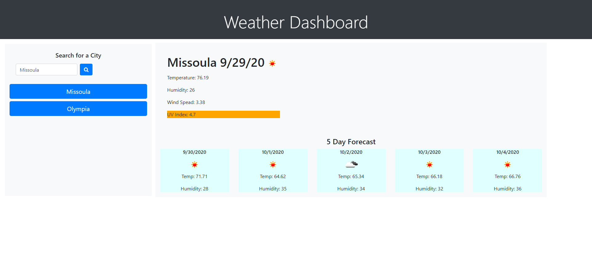
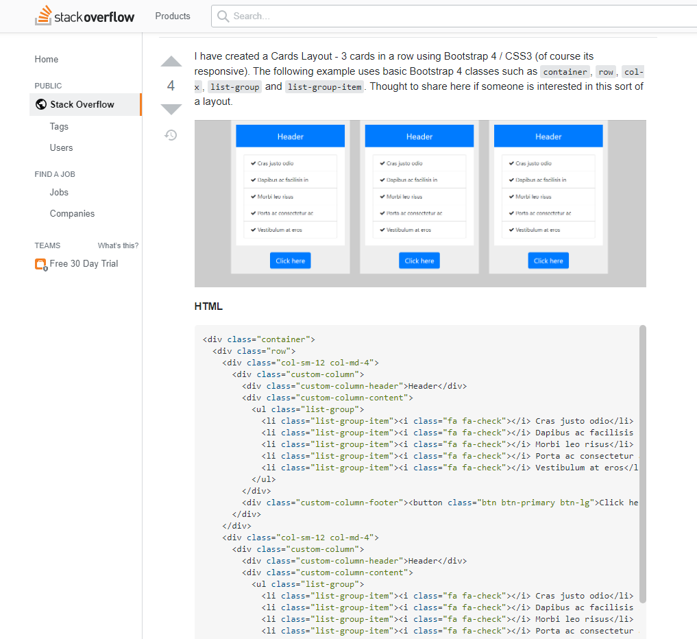

#  Weather-Dashboard

### A simple app that pulls data from openweather api to display weather outlooks for multiple cities.

## Table of Contents
* [Technologies Used](Technologies_Used)
* [Deployed Site](Deployed)
* [Features](Features)
* [Usage](Usage)
* [Author](Author)
* [Credits](Credits)
* [License](License)

## Technologies_Used
* HTML (38.4%)
* CSS (6.9%)
* Javascript (54.7%) 
* [Bootstrap] (https://getbootstrap.com/)
* [Moment.js] (https://momentjs.com/)
* [jQuery] (https://api.jquery.com/)
* [OpenWeather API](https://openweathermap.org/api)

## Deployed Site
[Weather-Dashboard](https://rksouth.github.io/Weather-Dashboard/)

## Features 

### __1. A city search__

Weather forecasts can be searched in a few ways. However, for most people looking up weather by city is the most practical. Also, for the API the most functional. Also, if we are trying to compare the weather across multiple cities it's important to be able to toggle back and forth and add more as needed. 

### __2. A view of current weather conditions__

A forecast without the current weather conditions is weird, it's just not done.

In order to do this I created a function that pulled in data from openweather and added it the page with a concatinated string everytime a button was pushed. I made sure that the button push cleared out the previous string and did not reload the page as well using prevent default and .empty. I did this in a similar way for the forecast section, just pulling from a different data set (that gave me a 5 day forecast) and making sure it ran in a for loop so I could pull data out for 5 days instead of 1 with just a single method. 
 
### __3. A 5 day Forecast__

Building this was the most challenging part of the code for me. I wanted to make sure I had pretty cards that worked dynamically with the page. I ended up using a format I found on stackoverflow that someone had made more themselves, and then modifying it to fit my own purposes. 

[Stackoverflow-cardcolumns](https://stackoverflow.com/questions/34140793/bootstrap-4-responsive-cards-in-card-columns)

### __4. Other__

 __For later builds__

_Be able to clear or remove cities from the list_

 The more I worked on this project, the more I wished there was an easier way to clear the cities from the list. A button next to cities button that pops up and allows the user to easily remove the city would imrpove usuability.

_Being able to select cities based on weather conditions_

Another thing I thought of while building this project that would be great is to do a reverse search. So search for the weather you want to experience for the next 5 days and pop what cities have that weather. Sometimes, in the dead of winter, I want to go somewhere sunny warm-or in the summer somewhere to cool off. Where are those places? For now, we have to look them up by name and try to see if they meet our criteria but hopefully not forever.

_The ability to toggle what you want to see_

I have never cared too much about windspeed but I desperately want to know what places feel like- if only there was some way to replace the windspeed with temperature feel and then have the computer save my settings so I don't have to go back every time. I don't exactly know what this would look like but I think it would really improve the usability of this product. 

_Add a fun background_

Backgrounds are fun, there should be more of them!

  

## Usage
### This is meant for anyone looking to see the 5 day weather forecase and compare it in multiple cities. 

## Author 
Rachael Kelm-Southworth

* [linkedin] (https://www.linkedin.com/in/rachael-kelm-southworth-87a3831b3) 

* [github] (https://github.com/RKSouth/)

 ## Credits

I would like to thank Kerwin, Manuel, Roger, Jerome and all my classmates for helping me understand this subject matter and anyone that contributed to make the base code.

## License
[MIT](https://choosealicense.com/licenses/mit/)

